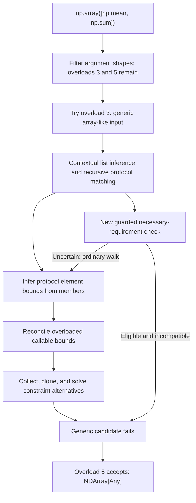

# Overload Resolution and the NumPy Array Case

This document explains how Pyright checks overloaded calls and why the expression
below can trigger expensive inference even though its final result is broad:

```python
import numpy as np

result = np.array([np.mean, np.sum])
reveal_type(result)
```

The example uses NumPy 2.4.6, Python 3.12, default Pyright settings, and the
requirement-first protocol implementation originally published in commit
`0ad37c137`, with ordinary-instance support added in this worktree. See the
[clean-port notes](requirement-first-validation.md) for its scope and validation.
NumPy's private
typing declarations are version-sensitive. This is an implementation explanation,
not a proposal to make Pyright recognize NumPy names specially.

## Short Version

- NumPy offers a generic array-like overload before a broad fallback. The checker
    must investigate the generic candidate even though the fallback eventually wins.
- Structural matching of a recursive sequence can infer a common element type
    before checking the requested specialization. Reconciling overloaded functions
    as element bounds can create many alternative constraint states.
- The new path recognizes a narrowly supported case where required protocol
    members are absent and rejects before that expensive reconciliation.
- Most of the additional complexity protects custom indexing contracts, caller
    inference effects, and cache validity. The older reduced-comparison path is a
    separate part of the change and has separate correctness obligations.

## Two Different Meanings of Overload Matching

1. **Call resolution:** choose which declarations of `np.array` can accept the
   supplied arguments, infer their type parameters, and determine a return type.
2. **Callable compatibility:** decide whether one function type can be assigned
   to another. Either type may itself contain multiple overload signatures.

The second operation can occur inside the first. In this example, `np.mean` and
`np.sum` are function objects passed as data. Pyright is not executing either
function, nor checking a call to them.

## The NumPy Overloads

NumPy 2.4.6 declares five `array` overloads in `numpy/_core/multiarray.pyi`.
The table summarizes the relevant parameter differences, not complete signatures.
Overload numbers here are one-based declaration order.

| Overload | Relevant input | Return | Eligible by argument shape here? |
| --- | --- | --- | --- |
| 1 | Array input, `dtype=None`, required `subok=True` | Same array type | No: `subok` is absent |
| 2 | Array-convertible input, `dtype=None`, required `subok=True` | Converted array type | No: `subok` is absent |
| 3 | `_ArrayLike[S]`, optional `dtype=None` | `NDArray[S]` | Yes |
| 4 | `Any` input, required typed `dtype` | `NDArray[S]` | No: `dtype` is absent |
| 5 | `Any` input, optional general `dtype` | `NDArray[Any]` | Yes |

The generic overload is tested before the general fallback. The fallback's
existence does not make the earlier candidate's inference free.

For overload 3, the relevant aliases can be summarized as:

```text
_ArrayLike[S] = SupportsArray[dtype[S]]
             | NestedSequence[SupportsArray[dtype[S]]]

SupportsArray[D]:
    __array__() -> ndarray[Any, D]

NestedSequence[T]:
    __len__() -> int
    __getitem__(int) -> T | NestedSequence[T]
    __iter__() -> Iterator[T | NestedSequence[T]]
    ... other read-only sequence members ...
```

These are explanatory abbreviations. The actual leaf protocol is
`numpy._typing._array_like._SupportsArray`; the sequence protocol is
`numpy._typing._nested_sequence._NestedSequence`. A separate `_SupportsArray`
declaration in `multiarray.pyi` is used by overload 2. The private generic
`_ArrayLike[S]` above is also different from the broader public `ArrayLike` alias.

A list of function objects does not satisfy this generic array-conversion
contract. It can still be passed to overload 5. The measured result is
`ndarray[tuple[Any, ...], dtype[Any]]`, with no errors or warnings. This does not
mean either input function's signature was erased to make overload 3 succeed.

## How an Overloaded Call Is Checked

The main entry for an overloaded call is
[`validateOverloadedArgTypes`](../packages/pyright-internal/src/analyzer/typeEvaluator.ts#L10807).
For ordinary function calls, the useful mental model is:

1. **Filter by argument shape.** `matchArgsToParams` checks positional and keyword
    arguments, missing required parameters, and unpacking. Only decorated overload
    declarations participate, not the implementation signature.
2. **Try the remaining candidates with types.**
    `validateOverloadsWithExpandedTypes` evaluates candidates in declaration order.
    Each trial gets cloned or fresh constraints and runs speculatively. Candidate
    parameter types can provide expected types for argument expressions.
3. **Distinguish definitive and ambiguous matches.** An unambiguous successful
    candidate can stop the search. Matches involving `Any`, `Unknown`, or uncertain
    unpacking may require examining more candidates. Additional filtering and
    return-type comparison resolve some ambiguities; unresolved ones can produce
    `Any` or `Unknown`, depending on the case. This is not universally a
    first-success algorithm.
4. **Expand argument unions if no candidate works.** The checker can retry with
    combinations of individual argument alternatives. Each expanded argument list
    must find a match. This implementation limits total expansion to 256 argument
    lists. This limit is unrelated to the constraint-set limit discussed below.
5. **Finalize a successful match.** Relevant constraints are copied back when
    appropriate, return types are combined across expanded calls, and a retained
    match is evaluated again to populate final expression types and diagnostics.
6. **Explain failure if nothing matches.** Outside suppressed diagnostic contexts,
    the checker chooses a candidate using its argument-match score, with later
    overloads winning ties, and performs a diagnostic check. The failed call's
    result is `Unknown` rather than a confidently selected overload return.

See
[`validateOverloadsWithExpandedTypes`](../packages/pyright-internal/src/analyzer/typeEvaluator.ts#L10009)
for trials and finalization, and
[`filterOverloadMatchesForAnyArgs`](../packages/pyright-internal/src/analyzer/typeEvaluator.ts)
for gradual-type ambiguity handling. Constructor-specific details are outside
this walkthrough.

### Expected Types and Repeated Evaluation

There are two distinct sources of context:

- An expected **result type**, such as an annotated assignment around the call,
  may constrain a generic function's return type before its arguments are checked.
  `validateArgTypesWithContext` handles this. The exact example has no such result
  annotation.
- The candidate's **parameter type** supplies context to the corresponding
  argument expression. Overload 3 gives the list literal an `_ArrayLike[S]`
  context even without a result annotation.

An expression therefore need not have one precomputed type that is reused for
every overload. A list literal, lambda, or other context-sensitive expression can
be evaluated differently under different candidates. Speculation suppresses
publication of final expression types and diagnostics for a trial; it does not
mean the trial is cheap or that every internal cache is rolled back wholesale.

## How Callable Types Are Compared

The central convention is `assignType(destination, source, ...)`: can a value of
the source type be used where the destination is required?

For simple function types, parameters are checked contravariantly and returns
covariantly, along with parameter names, kinds, defaults, and generic constraints.
For example, a function accepting `object` and returning `int` can fulfill a
requirement to accept `int` and return `object`. The reverse is not safe.

Overload sets add two different quantifiers:

| Destination | Source | Main compatibility requirement |
| --- | --- | --- |
| One function signature | One function signature | Compare the signatures |
| One function signature | Overload set | At least one source signature must work |
| Overload set | One function or an overload set | Every destination signature must be supported |

These are the normal compatibility rules, not the separate rules for detecting
overlapping overload declarations. Special flags and staged argument inference
can defer some work, so the table is not a replacement for the implementation.

In particular, for one destination signature and an overloaded source, Pyright
normally tests **all** source signatures to collect successful inference
alternatives. It does not simply stop after finding the first compatible one.
Each trial uses `cloneWithSignature` to select or tag the relevant signature
context, and successful constraint sets are collected with `addConstraintSets`.
During `ArgAssignmentFirstPass`, this overloaded-source check is deferred.

When both sides have equally many overloads, Pyright first tries a positional
one-to-one mapping. If it cannot establish compatibility that way, it falls back
to checking each destination signature against the source set. This avoids a
pairwise search in some common cases, but unequal counts cannot take that shortcut.

See the function and overloaded-type branches of
[`assignType`](../packages/pyright-internal/src/analyzer/typeEvaluator.ts#L26863)
and [`assignFunction`](../packages/pyright-internal/src/analyzer/typeEvaluator.ts#L28215).

### Why Constraints Can Multiply

A `ConstraintSet` stores one alternative collection of TypeVar bounds, literal
retention metadata, and scope IDs. A `ConstraintTracker` contains one or more
such alternatives. A lower bound is a type the inferred variable must accommodate;
an upper bound restricts which types it may become. Solving those bounds and
substituting the solutions are additional operations, not the same thing as
recording a bound.

Suppose a comparison starts with several constraint alternatives and more than
one source overload works. Each working signature can preserve or extend several
alternatives. A later comparison can repeat this branching. A schematic example
is `1 -> 2 -> 4 -> 8`; the actual growth depends on signature scopes, bounds, and
which comparisons succeed. This is not a claim that every overloaded comparison
has exponential cost.

The expensive part can therefore exceed the number of signature pairs. Each pair
may clone, compare, specialize, or solve many existing constraint sets. In
[`addConstraintSets`](../packages/pyright-internal/src/analyzer/constraintTracker.ts#L230),
the current limit is 1,024: an incoming collection is installed only if its length
is strictly below that limit. Reaching it does not make all earlier work free,
and the implementation does not simply truncate each incoming collection to
1,024 entries. This change does not alter that behavior.

## The Exact Array Call, Step by Step

### 1. The Entries Are Overloaded Function Objects

The installed NumPy declarations contain 11 overload declarations for `mean` and
9 for `sum` in `numpy/_core/fromnumeric.pyi`. Their signatures distinguish inputs,
axes, output arrays, and dtype choices. Here none of those parameters is supplied:
the expression refers to the functions themselves.

For the rest of the explanation, call their types `MeanOverloads` and
`SumOverloads`. These are labels for complete callable types, not new aliases
introduced by the implementation.

### 2. The Generic Array Candidate Gives the List a Union Context

Overload 3 asks whether the argument can be used as `_ArrayLike[S]`. This requires
considering direct array conversion and the recursive sequence alternative.

[`getTypeOfListOrSet`](../packages/pyright-internal/src/analyzer/typeEvaluator.ts#L15767)
tries expected union alternatives speculatively. Its contextual path derives an
expected element type through `getExpectedEntryTypeForIterable`, evaluates the
entries with context, and uses `inferTypeArgFromExpectedEntryType` to check them
with a shared tracker. Failure to honor context can fall back to ordinary list
inference and then to an assignment check against the candidate parameter.

An important default-setting detail: a list evaluated with an expected type may
retain a union of its entry types even when contextual inference fails. Without
an expected type, a heterogeneous list defaults to `list[Unknown]` unless strict
list inference is enabled. Therefore this is not an equivalent benchmark:

```python
functions = [np.mean, np.sum]
result = np.array(functions)
```

Prebinding can change the information available during matching. Replacing the
inline expression with a prebound variable can accidentally remove the expensive
case rather than optimize it.

### 3. Structural Sequence Matching Infers Before Final Specialization

Consider the relevant assignment with the callable information retained:

```text
source:      list[MeanOverloads | SumOverloads]
destination: NestedSequence[SupportsArray[dtype[S]]]
```

The ordinary protocol walk does not treat this as only a member-existence test.
It builds protocol-local constraints, specializes and binds corresponding members,
then compares their types. A successful member comparison contributes its cloned
constraints back to the protocol tracker. After successful member checks, the
checker solves the protocol's inferred type arguments and checks them against
the requested destination specialization using the caller's constraints.

Thus there are several distinct kinds of variables: NumPy's desired scalar `S`,
the sequence protocol's element parameter, and type parameters belonging to the
individual callable signatures. They are not one interchangeable `T`.

The sequence members expose the same element parameter repeatedly, for example
through indexing and iterator return types. Inferring that parameter can collect
the two callable types as lower-bound information before the final requested
`SupportsArray[dtype[S]]` relationship rejects the candidate.

See the member comparison and final argument check in
[`assignToProtocolInternal`](../packages/pyright-internal/src/analyzer/protocols.ts#L823).

### 4. Combining Lower Bounds Can Compare Mean Against Sum

Recording both entry types does not always mean immediately forming a union.
[`assignUnconstrainedTypeVar`](../packages/pyright-internal/src/analyzer/constraintSolver.ts#L764)
first tries to determine whether an existing lower bound already accommodates a
new one, or vice versa. Those tests call `assignType` with the current constraints.
If neither direction works, the solver may specialize and combine the bounds.

If the existing bound contains `MeanOverloads` and the incoming type contains
`SumOverloads`, these subsumption tests can enter overloaded-callable compatibility.
Different source signatures can produce different inference alternatives. Further
member checks and solving revisit those alternatives.

This explains the otherwise surprising question: **why compare the signatures of
`mean` and `sum` when deciding whether a list is array-like?** The comparison is a
consequence of generic lower-bound reconciliation, not a requirement that NumPy
execute either function or that the user called them with compatible arguments.

This mechanism is grounded in the source and earlier instrumented investigations
of related NumPy sequence assignments. The diagram below is a logical walkthrough,
not a timestamped trace of every invocation in the exact benchmark. It does not
claim every protocol member or candidate takes the same path on every visit.



### 5. The Broad Fallback Succeeds

The general `Any` input overload accepts the expression and returns
`NDArray[Any]`. This broad result comes from NumPy's declared fallback contract.
An unannotated `np.array(...)` call need not infer a precise object dtype from
arbitrary Python objects. An explicit dtype or an array input can select different
overloads; those are separate cases, not evidence for this path's performance.

The optimization avoids expensive work on an incompatible generic candidate. It
does not invent a new return type, select overload 5 by a NumPy-specific rule, or
replace overloaded functions with `Any` to force compatibility.

## What the Optimization Actually Changes

The change is in protocol assignment, not in the overload-selection loop, general
list-inference rules, or constraint solver. It has two paths that must be reviewed
separately.

### Path A: Reject by Missing Necessary Members

For an eligible recursive sequence target, its integer indexing return must be
exactly `Leaf | Sequence[Leaf]`. A supported builtin list returns its element type
when indexed this way. If each eligible element lacks both the leaf's required
member and `__getitem__`, neither destination alternative can be satisfied.

For NumPy, the leaf member is `__array__`, discovered from the protocol declaration.
For another library it could be `serialize` or `read`. Actual function/method
classes are looked up through the evaluator; absence is not assumed merely
because an element is represented as a function type.

Ordinary class instances can use this path too, provided their MRO is known,
they have no unresolved specialization or conditional type constraints, and
they are neither protocol nor TypedDict instances. Dynamic attribute providers
fall back: `__getattr__` or a custom `__getattribute__` prevents this proof.
Inherited capabilities are checked, and every alternative of a mixed union
must meet the absence requirements.

This path avoids callable-signature reconciliation. It returns a negative result
for this protocol candidate, not a positive result for the outer array call.

### Path B: Compare Only the Necessary Element Relationship

The older path uses `assignType(Leaf | Sequence[Leaf], sourceElement, ...)` with
cloned constraints. If that reduced comparison fails, it rejects the sequence
candidate. This can cover lists of non-function types too, but it can itself do
callable matching when the element types are callable. It is not the same cheap
missing-member proof as Path A.

Both paths are implemented in
[`tryFastRejectSequenceProtocol`](../packages/pyright-internal/src/analyzer/protocols.ts).

### Why There Are So Many Guards

| Restriction | Reason |
| --- | --- |
| Builtin list instance only | Other containers can expose different indexing semantics; a generic argument alone is not the index return contract |
| Known element type; no top-level Any, Unknown, or TypeVar | Uncertain elements cannot support this rejection argument |
| One covariant destination parameter and argument | Limits the inference and variance relationships the shortcut handles |
| Recognized read-only sequence members, including length, indexing, and iteration | Restricts the structural shape; names alone are not the proof |
| Exact bound integer-index return `Leaf \| Sequence[Leaf]` | Establishes the necessary element relationship |
| Recognized two-overload list indexing declaration with implicit instance self and element return | Custom stubs may erase the index return or specialize self; those cases fall back |
| Destination integer index cannot match the source slice parameter | A custom overlapping domain can let the slice overload satisfy indexing independently of the element type |
| Path A: every element has an eligible known function/method or ordinary-instance MRO | Supports actual member lookup instead of assuming a type category lacks capabilities |
| Path A: ordinary instances have no unresolved specialization, conditions, or dynamic attribute hooks; protocols and TypedDicts fall back | Limits absence checks to supported, statically known instance behavior |
| Path A: one declared leaf member other than `__call__`, missing along with `__getitem__` | Excludes callback protocols and elements that can satisfy either recursive alternative |
| Path A: populated caller tracker plus destination requiring specialization falls back | Ordinary failed matching can update caller bounds and alter later inference |
| Path B: uncertain destination element or specialized-variable destination with a tracker falls back | A reduced comparison must not silently replace observable generic inference |
| No ordinary non-speculative detailed diagnostic shortcut | Detailed failure checking can provide both diagnostics and inference effects |
| No shortcut during universal compatibility checks | A specialization-specific failure must not become a generic failure for all specializations |

These restrictions narrow applicability. They are not a claim that all possible
state/cache interactions have been proven equivalent.

## Why Rejection Still Needs a Correctness Argument

`false` is not the only observable output of type matching. Comparisons can alter
constraints, retain or widen literals, populate caches, or affect what a later
comparison infers. A failed function comparison may infer a TypeVar from parameters
before finding an incompatible return type.

An earlier candidate demonstrated a concrete continuation difference: ordinary
failed matching widened a stored lower bound from `Literal[7]` to `int`, while
early rejection retained the literal. Both contexts initially solved to `int`,
but a later invariant or contravariant assignment could return different answers.
Comparing only the immediate rejection or printed solution would miss this.
The populated-context fallback addresses that demonstrated case; the implementation
does not attempt to replay a selected subset of ordinary inference effects.

Fast cache entries are tagged and remain specialization-specific. Cache matching
includes constraint scope order and literal-retention metadata. An ordinary
diagnostic check can replace a matching fast entry; fast negatives do not justify
universal incompatibility. Non-speculative diagnostic retries remain available.
These rules are necessary safeguards, not a proof of every recursive cache state.

Remaining review questions include pending recursive assumptions, reentrant and
speculative checks, recursion limits, assignment flags, shared mutable type state,
and the generality of custom-stub contract checks. Publishing this branch does
not resolve those questions.

## Evidence and Its Limits

| Check | Result for the published implementation |
| --- | --- |
| Full regression suite | 83 suites, 2,907 tests pass; Jest reported listener/worker-shutdown warnings |
| Exact inline NumPy expression | Candidate wall times 1.207s, 1.168s, 1.134s; median analysis time 0.726s |
| Prior protocol control, same exact expression | Median wall time 16.415s across three alternating fresh-process pairs |
| Output comparison for these pairs | Exact diagnostic arrays and revealed result type agree |
| Overlapping-index regression cases | Four cases pass normally and with shortcut dispatch disabled |
| Caller-state continuation matrix | Twelve cases passed normally and with dispatch disabled before the final index-overlap guard; all are included in the final full suite |

The timing control is the prior protocol implementation, **not plain upstream**.
The clean candidate excludes the separate constraint-solving early-return change,
copy-on-write experiments, and solver-result reuse experiments. The measured
improvement is about avoiding unnecessary matching work, not making each solver
operation universally faster. Subsecond analysis is not subsecond CLI wall time.

Pandas and SymPy had zero diagnostic differences in fresh upstream/control/candidate
comparisons before the final index-overlap guard. Those runs included 198 unresolved
imports in pandas and 210 unresolved-import/source diagnostics in SymPy. They are
limited-dependency regression evidence, not clean project checks, a comparison of
every inferred type, or validation of the final guard revision.

### Reproducing the Main Check

Use the example at the top in a Python file and an empty `{}` Pyright configuration
to avoid unrelated project settings. Install NumPy 2.4.6 in the Python environment
being analyzed. Build the analyzer before bundling the CLI:

```sh
pnpm install --frozen-lockfile
pnpm --dir packages/pyright-internal run build
pnpm run build:cli:dev
node packages/pyright/index.js --pythonpath /path/to/python --pythonversion 3.12 --project /path/to/empty-config.json --outputjson /path/to/example.py
```

The measurements above used Node 24.15.0 and Python 3.12.3. Measure process wall time
separately from JSON `summary.timeInSec`, run multiple fresh processes, and record
both source revision and built bundle hashes. Confirm imports resolve and compare
the diagnostic arrays, not just exit codes. Do not substitute the prebound-variable
example or enable strict list inference without labeling that as a different test.

## Review and Navigation Guide

| Question | Relevant code or tests |
| --- | --- |
| How are outer call candidates selected? | [typeEvaluator.ts](../packages/pyright-internal/src/analyzer/typeEvaluator.ts): `validateOverloadedArgTypes`, `validateOverloadsWithExpandedTypes` |
| How does context reach list elements? | [typeEvaluator.ts](../packages/pyright-internal/src/analyzer/typeEvaluator.ts): `getTypeOfListOrSet`, `getExpectedEntryTypeForIterable`, `inferTypeArgFromExpectedEntryType` |
| Why do callable alternatives branch? | [typeEvaluator.ts](../packages/pyright-internal/src/analyzer/typeEvaluator.ts): `assignType`, `assignFunction`; [constraintTracker.ts](../packages/pyright-internal/src/analyzer/constraintTracker.ts): `cloneWithSignature`, `addConstraintSets` |
| Why compare an existing lower bound to a new one? | [constraintSolver.ts](../packages/pyright-internal/src/analyzer/constraintSolver.ts): `assignUnconstrainedTypeVar` |
| Where is early rejection dispatched and cached? | [protocols.ts](../packages/pyright-internal/src/analyzer/protocols.ts): `assignClassToProtocol`, `assignToProtocolInternal`, `getProtocolCompatibility`, `setProtocolCompatibility` |
| Can functions expose the required capabilities? | [protocolRequirementAdversarial.test.ts](../packages/pyright-internal/src/tests/protocolRequirementAdversarial.test.ts), [protocolRequirementBoundary.test.ts](../packages/pyright-internal/src/tests/protocolRequirementBoundary.test.ts), [protocolRequirementGeneral.test.ts](../packages/pyright-internal/src/tests/protocolRequirementGeneral.test.ts) |
| What if builtin list indexing is customized? | [protocolRequirementListStub.test.ts](../packages/pyright-internal/src/tests/protocolRequirementListStub.test.ts) |
| Can failed matching affect later inference? | [protocolRequirementPopulated.test.ts](../packages/pyright-internal/src/tests/protocolRequirementPopulated.test.ts) |
| Are positive and mixed callable cases retained? | [protocolRequirementOverloads.py](../packages/pyright-internal/src/tests/samples/protocolRequirementOverloads.py) |
| What tests cover the older path and cache reuse? | [typeEvaluator7.test.ts](../packages/pyright-internal/src/tests/typeEvaluator7.test.ts): the `Protocol36` tests |

The review should ask three separate questions: is the necessary incompatibility
established, is skipping the remaining inference observationally safe, and is the
failure cached only where it remains valid? The performance result answers none of
those by itself. Keeping these questions separate is the simplest way to reason
about the implementation's complexity.